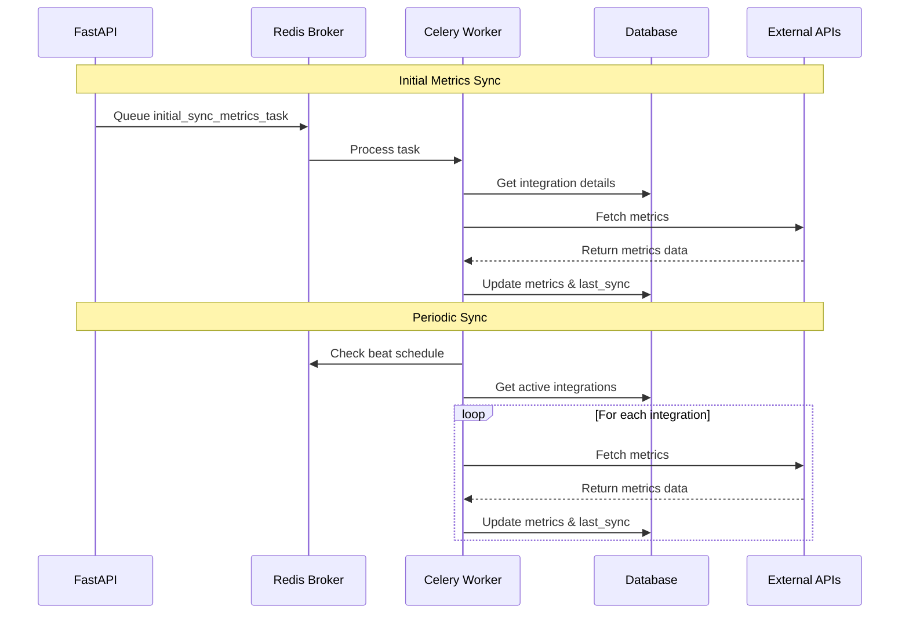

# Celery Background Tasks in AgileTrack

<!-- @import "[TOC]" {cmd="toc" depthFrom=1 depthTo=6 orderedList=false} -->

<!-- code_chunk_output -->

- [Celery Background Tasks in AgileTrack](#celery-background-tasks-in-agiletrack)
  - [What is Celery and Why Do We Use It?](#what-is-celery-and-why-do-we-use-it)
    - [The Problem We're Solving](#the-problem-were-solving)
    - [How Celery Helps](#how-celery-helps)
    - [Real-World Example](#real-world-example)
    - [The Benefits](#the-benefits)
    - [Celery and Caching](#celery-and-caching)
  - [Architecture Overview](#architecture-overview)
  - [Task Flow](#task-flow)
  - [Configuration](#configuration)
    - [Redis Setup](#redis-setup)
    - [Beat Schedule](#beat-schedule)
  - [Tasks](#tasks)
    - [1. Initial Metrics Sync (`initial_sync_metrics_task`)](#1-initial-metrics-sync-initial_sync_metrics_task)
    - [2. Periodic Sync (`periodic_sync_all_integrations_metrics_task`)](#2-periodic-sync-periodic_sync_all_integrations_metrics_task)
  - [Error Handling](#error-handling)
    - [Retry Mechanism](#retry-mechanism)
    - [Error Types Handled](#error-types-handled)
  - [Monitoring and Logging](#monitoring-and-logging)
    - [Task Logging](#task-logging)
    - [Performance Metrics](#performance-metrics)
  - [Development Setup](#development-setup)
  - [Production Deployment](#production-deployment)
    - [Recommended Configuration](#recommended-configuration)
    - [Environment Variables](#environment-variables)
  - [Best Practices](#best-practices)
  - [Troubleshooting](#troubleshooting)
    - [Common Issues](#common-issues)
    - [Debug Commands](#debug-commands)
  - [Future Improvements](#future-improvements)
  - [Contributing](#contributing)
  - [License](#license)

<!-- /code_chunk_output -->

This document describes how AgileTrack uses Celery for background task processing and metrics synchronization.

## What is Celery and Why Do We Use It?

Think of Celery as a task manager for our application. Here's why we need it:

### The Problem We're Solving
When you connect AgileTrack to services like GitHub or Jira, we need to fetch lots of data (like pull requests, issues, and commits) to calculate your team's metrics. This data fetching can take a long time - sometimes several minutes. If we tried to do this while you're waiting for a response from the website, you'd be staring at a loading spinner for a very long time!

### How Celery Helps
Celery solves this problem by:
1. **Working in the Background**: Instead of making you wait, Celery takes these long-running tasks and processes them behind the scenes.
2. **Keeping Things Organized**: It's like having a to-do list manager that keeps track of all the tasks that need to be done.
3. **Handling Failures Gracefully**: If something goes wrong (like a temporary network issue), Celery will automatically retry the task.

### Real-World Example
Let's say you connect your GitHub repository to AgileTrack:
1. You click "Connect GitHub" in the interface
2. Instead of waiting for all the data to be fetched, you get an immediate response
3. Celery takes over and starts fetching your repository data in the background
4. You can continue using the application while this happens
5. Once the data is ready, it's automatically updated in your dashboard

### The Benefits
- **Better User Experience**: No long waiting times
- **Reliability**: Tasks are retried if they fail
- **Scalability**: We can process multiple tasks simultaneously
- **Consistency**: Regular updates of your team's metrics

### Celery and Caching
Celery provides built-in caching capabilities that help improve performance:

1. **Result Backend Caching**
   - When a task completes, its result is stored in Redis
   - Results are cached for a configurable time period
   - This prevents unnecessary re-computation of the same data
   - Example: If we fetch GitHub metrics, the results are cached for 1 hour

2. **Task Result Caching**
   ```python
   @app.task(bind=True, cache_backend='redis')
   def fetch_github_metrics(self, repo_id):
       # Task implementation
   ```
   - Task results are automatically cached
   - Subsequent calls with the same parameters return cached results
   - Configurable cache expiration times
   - Helps reduce load on external APIs

3. **Integration with Our Caching System**
   - Celery's caching works alongside our application's caching:
     - Frontend: Local storage and in-memory cache
     - Backend: Redis for Celery results
     - Database: Cached queries for frequently accessed data

4. **Cache Invalidation**
   - Automatic cache invalidation when data changes
   - Manual cache clearing when needed
   - Configurable cache timeouts per task type
   - Example: GitHub metrics cache is cleared when new commits are pushed

## Architecture Overview

```
┌─────────────────┐     ┌─────────────────┐     ┌─────────────────┐
│                 │     │                 │     │                 │
│  FastAPI Backend│─────│  Celery Worker  │─────│  Redis Broker   │
│                 │     │                 │     │                 │
└─────────────────┘     └─────────────────┘     └─────────────────┘
        │                        │                        │
        │                        │                        │
        ▼                        ▼                        ▼
┌─────────────────┐     ┌─────────────────┐     ┌─────────────────┐
│                 │     │                 │     │                 │
│  External APIs  │     │  PostgreSQL DB  │     │  Celery Beat    │
│  (GitHub/Jira)  │     │                 │     │  (Scheduler)    │
└─────────────────┘     └─────────────────┘     └─────────────────┘
```

## Task Flow



## Configuration

### Redis Setup
```python
redis_url = os.getenv('REDIS_URL', 'redis://localhost:6379/0')
app = Celery('agiletrack', broker=redis_url, backend=redis_url)

app.conf.update(
    task_serializer='json',
    accept_content=['json'],
    result_serializer='json',
    timezone='UTC',
    enable_utc=True,
)
```

### Beat Schedule
```python
app.conf.beat_schedule = {
    'sync-all-metrics-every-hour': {
        'task': 'src.backend.tasks.periodic_sync_all_integrations_metrics_task',
        'schedule': 3600.0,  # Run every hour
    },
}
```

## Tasks

### 1. Initial Metrics Sync (`initial_sync_metrics_task`)

Triggered when a new integration is created to perform the first metrics sync.

```python
@app.task(bind=True, max_retries=3, default_retry_delay=60)
def initial_sync_metrics_task(self, integration_id: int):
    # Task implementation
```

**Features:**
- Maximum 3 retries
- 60-second delay between retries
- Updates integration's last_sync timestamp
- Handles configuration validation
- Supports all integration types (GitHub, Jira, Trello)

### 2. Periodic Sync (`periodic_sync_all_integrations_metrics_task`)

Runs on a schedule to keep all integration metrics up to date.

```python
@app.task(bind=True, max_retries=2, default_retry_delay=300)
def periodic_sync_all_integrations_metrics_task(self):
    # Task implementation
```

**Features:**
- Runs every hour
- Maximum 2 retries
- 5-minute delay between retries
- Processes all active integrations
- Tracks successful and failed syncs
- Continues processing even if some integrations fail

## Error Handling

### Retry Mechanism
- Tasks automatically retry on transient errors
- Configurable retry counts and delays
- Error logging for debugging
- Last sync timestamp updates even on failures

### Error Types Handled
1. **Configuration Errors**
   - Missing API keys
   - Invalid repository/project configurations
   - Malformed integration settings

2. **API Errors**
   - Rate limiting
   - Authentication failures
   - Network timeouts

3. **Database Errors**
   - Connection issues
   - Constraint violations
   - Transaction failures

## Monitoring and Logging

### Task Logging
```python
print(f"Celery task started for integration_id: {integration_id}")
print(f"Processing integration: {integration.name} ({integration.type})")
print(f"Successfully synced metrics for integration {integration_id}")
```

### Performance Metrics
- Successful syncs count
- Failed syncs count
- Processing time per integration
- Last sync timestamps

## Development Setup

1. **Install Dependencies**
```bash
pip install celery redis
```

2. **Start Redis Server**
```bash
redis-server
```

3. **Start Celery Worker**
```bash
celery -A src.backend.tasks worker --loglevel=info
```

4. **Start Celery Beat** (for periodic tasks)
```bash
celery -A src.backend.tasks beat --loglevel=info
```

## Production Deployment

### Recommended Configuration
```bash
# Start Celery worker with production settings
celery -A src.backend.tasks worker --loglevel=info --concurrency=4

# Start Celery beat for periodic tasks
celery -A src.backend.tasks beat --loglevel=info
```

### Environment Variables
```
REDIS_URL=redis://localhost:6379/0
CELERY_BROKER_URL=redis://localhost:6379/0
CELERY_RESULT_BACKEND=redis://localhost:6379/0
```

## Best Practices

1. **Task Design**
   - Keep tasks idempotent
   - Use appropriate retry strategies
   - Handle partial failures gracefully
   - Update timestamps even on failures

2. **Resource Management**
   - Close database connections properly
   - Handle API rate limits
   - Monitor memory usage
   - Implement timeouts

3. **Error Handling**
   - Log all errors with context
   - Implement appropriate retry delays
   - Update status even on failures
   - Monitor failed tasks

4. **Performance**
   - Use connection pooling
   - Implement caching where appropriate
   - Monitor task execution times
   - Scale workers based on load

## Troubleshooting

### Common Issues

1. **Task Not Starting**
   - Check Redis connection
   - Verify worker is running
   - Check task registration
   - Review logs for errors

2. **Task Failures**
   - Check integration configuration
   - Verify API credentials
   - Review error logs
   - Check database connectivity

3. **Performance Issues**
   - Monitor Redis memory usage
   - Check worker concurrency
   - Review task execution times
   - Monitor database performance

### Debug Commands
```bash
# Check Celery worker status
celery -A src.backend.tasks status

# Inspect active tasks
celery -A src.backend.tasks inspect active

# Check scheduled tasks
celery -A src.backend.tasks inspect scheduled

# Monitor task events
celery -A src.backend.tasks events
```

## Future Improvements

1. **Planned Enhancements**
   - Add task prioritization
   - Implement task routing
   - Add more detailed metrics
   - Improve error reporting

2. **Monitoring**
   - Add Prometheus metrics
   - Implement Grafana dashboards
   - Add alerting system
   - Improve logging

3. **Performance**
   - Implement task batching
   - Add caching layer
   - Optimize database queries
   - Add rate limiting

## Contributing

When adding new Celery tasks:

1. Follow the existing task patterns
2. Add appropriate error handling
3. Include logging statements
4. Update this documentation
5. Add tests for new tasks

## License

This document is part of the AgileTrack project and is subject to the same license terms. 